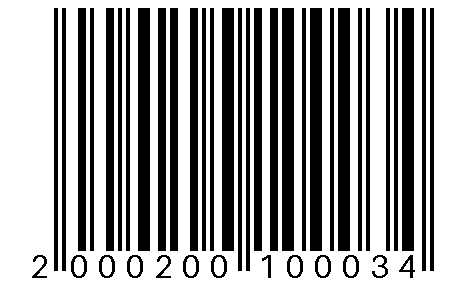

# ean-tools

Herramienta local para **generar y gestionar códigos EAN-13 de uso interno**: calcula el dígito de control,
organiza el catálogo en categorías, productos y variantes (tallas, colores…), genera imágenes PNG
listas para imprimir a un tamaño físico exacto y exporta un CSV que Excel abre bien a la primera.

Se usa desde una **interfaz web local** pensada para cualquiera o desde la **línea de comandos**.
No necesita internet, cuentas ni base de datos: todo vive en un archivo `catalogo.json`.



> [!IMPORTANT]
> **Solo uso interno.** Los códigos usan el prefijo `200`–`299`, el rango que GS1 reserva para
> circulación restringida dentro de una empresa. Sirven para etiquetas propias, inventario, TPV
> y tienda online propia. **No sirven** para vender en Amazon u otros marketplaces ni para
> distribuir a tiendas de terceros: para eso hace falta un prefijo de empresa de GS1.

## Qué es y qué no es

| Sí | No |
|---|---|
| Generador de EAN-13 internos con dígito de control correcto | Sustituto de los códigos oficiales de GS1 |
| Catálogo simple en JSON (o CSV) editable a mano o desde la web | Sistema de inventario o de stock |
| PNG nítidos al tamaño de tu etiqueta y tu impresora | Diseñador de etiquetas ni generador de PDFs |
| CSV para importar en el TPV o en una hoja de cálculo | Integración con WooCommerce, TPVs o APIs |

## Estructura del código

```
200  CC  PPP  VVVV  D
 │    │   │    │    └─ dígito de control (se calcula solo)
 │    │   │    └────── variante (talla, color…); 0000 = producto sin variantes
 │    │   └─────────── producto dentro de la categoría (001-999)
 │    └─────────────── categoría (01-99)
 └──────────────────── prefijo interno (200 por defecto, 200-299 permitido)
```

Ejemplo: categoría `02` (Camisetas), producto `001` (Camiseta técnica), variante `0003` (Talla M)
→ `2000200100034`.

Cómo numerar las variantes es decisión tuya; una convención que funciona bien es reservar
`00xx` para tallas y `01xx` para colores. Lo único que exige la herramienta es que dentro de un
producto no se repitan.

## Instalación

Requiere Python 3.11 o superior.

```bash
pip install "ean-tools[web] @ git+https://github.com/borjaiturregui/EAN-tools"
```

Extras disponibles:

| Instalación | Incluye |
|---|---|
| `ean-tools` | Núcleo, CLI y CSV (sin imágenes) |
| `ean-tools[images]` | + imágenes PNG (Pillow) |
| `ean-tools[web]` | + imágenes + interfaz web (FastAPI, Uvicorn) |
| `ean-tools[dev]` | + tests |

## Uso: interfaz web

```bash
ean-tools web
```

Abre el navegador en `http://127.0.0.1:8765`. Desde ahí:

1. Crea las categorías.
2. Añade productos y, si los tienen, sus variantes.
3. Elige el tamaño de la etiqueta (mm) y los DPI de tu impresora.
4. Pulsa **Guardar y generar** y descarga el CSV o el ZIP con el CSV y todas las imágenes.

El catálogo se guarda en `catalogo.json` (o el que indiques con `--catalog`). Si tiene errores
(códigos repetidos, categorías que no existen…) la web los lista todos y **no** sobrescribe el
archivo. El servidor solo escucha en `127.0.0.1` y rechaza peticiones con un `Host` que no sea
local, así que no es accesible desde otros equipos ni desde otras webs.

## Uso: línea de comandos

```bash
ean-tools init                                 # crea catalogo.json de ejemplo
ean-tools generate -c catalogo.json -o salida  # CSV + una imagen por código
ean-tools generate --width-mm 50 --height-mm 30 --dpi 203
ean-tools generate --no-images                 # solo el CSV
ean-tools validate 2000100100004 4006381333931 # sale con código 1 si alguno es inválido
ean-tools export -o codigos.csv                # listado de códigos (sin generar imágenes)
ean-tools export -o catalogo.csv --catalog-csv # catálogo en formato tabla para editar en Excel
ean-tools web --port 9000 --no-browser
```

`ean-tools --help` y `ean-tools <comando> --help` muestran todas las opciones.

Resultado de `generate`:

```
salida/
├── productos_ean.csv
└── barcodes/
    ├── EAN_2000100100004_CALC-CORTO.png
    └── …
```

Regenerar es seguro: se sobrescriben los archivos con el mismo nombre y no se toca nada más de
la carpeta. Si eliminas un producto del catálogo, su imagen antigua queda en `barcodes/`; bórrala
a mano o genera en una carpeta nueva.

## Formato del catálogo

JSON (formato principal, ver [`examples/catalogo_ejemplo.json`](examples/catalogo_ejemplo.json)):

```json
{
  "format": 1,
  "prefix": "200",
  "categories": {"01": "Calcetines", "02": "Camisetas"},
  "products": [
    {"category": "01", "code": "001", "name": "Calcetín corto", "label": "CALC-CORTO", "variants": []},
    {"category": "02", "code": "001", "name": "Camiseta técnica", "label": "CAMI-TEC",
     "variants": [{"code": "0002", "name": "Talla S", "label": "CAMI-TEC-S"}]}
  ]
}
```

- `label` (etiqueta) es el nombre corto que aparece en el nombre del archivo de imagen. Es
  opcional: si falta, se genera a partir del nombre (sin acentos ni espacios).
- Los códigos numéricos cortos se completan con ceros (`"1"` → `"01"`), porque Excel suele
  quitarlos al guardar.

También se admite un CSV plano, una fila por variante
([`examples/catalogo_ejemplo.csv`](examples/catalogo_ejemplo.csv)):

```
categoria;nombre_categoria;producto;nombre_producto;etiqueta_producto;variante;nombre_variante;etiqueta_variante
01;Calcetines;001;Calcetín corto;CALC-CORTO;;;
02;Camisetas;001;Camiseta técnica;CAMI-TEC;0002;Talla S;CAMI-TEC-S
```

El CSV no guarda el prefijo; si no usas `200`, pásalo con `--prefix`.

## Imprimir bien los códigos

- **Pon los DPI reales de tu impresora** (las térmicas de etiquetas suelen ser de 203 o 300 DPI).
  Las barras se dibujan con un número entero de píxeles por módulo; si la imagen se imprime a
  otra resolución, el driver la reescala y las barras dejan de ser uniformes.
- Imprime al **100 %**, sin "ajustar a página".
- La herramienta avisa si la barra más fina queda por debajo de 0,264 mm (el mínimo de GS1) y se
  niega a generar por debajo de 0,2 mm, porque no se leería de forma fiable.
- Los PNG se generan en blanco y negro puro y con los márgenes en blanco (zonas de silencio) que
  exige el estándar.

## CSV de salida y Excel

`productos_ean.csv` usa `;` como separador y UTF-8 con BOM, así que Excel en español lo abre con
columnas y acentos correctos con doble clic. Columnas:
`EAN-13;Categoria;Producto;Variante_Codigo;Variante_Descripcion;Etiqueta;Imagen`.

Ojo: Excel muestra los números de 13 cifras en notación científica (`2,0001E+12`). El valor no se
pierde; basta con ensanchar la columna o darle formato "Número" sin decimales. Si guardas el
archivo desde Excel, comprueba que no lo ha convertido.

## Desarrollo

```bash
git clone https://github.com/borjaiturregui/EAN-tools
cd EAN-tools
python -m venv .venv && source .venv/bin/activate   # en Windows: .venv\Scripts\activate
pip install -e ".[dev]"
pytest
```

```
src/ean_tools/
├── core.py      # dígito de control, construcción, validación y codificación de barras (sin dependencias)
├── catalog.py   # modelo del catálogo, validación y lectura/escritura JSON/CSV
├── images.py    # PNG a tamaño físico exacto (Pillow)
├── export.py    # CSV de salida, carpeta de resultados y ZIP (compartido por CLI y web)
├── cli.py       # comandos (Click)
└── web/         # FastAPI + HTML/CSS/JS sin frameworks
```

La lógica no depende de la interfaz: la web y la CLI llaman a las mismas funciones. Los tests
comprueban el algoritmo con códigos reales conocidos, comparan la codificación de barras con
[python-barcode](https://pypi.org/project/python-barcode/) y **escanean las imágenes generadas**
con [zxing-cpp](https://pypi.org/project/zxing-cpp/) para asegurar que se leen. La CI los ejecuta en
Windows y Linux, y también sin las dependencias opcionales.

## Origen

Nació de un problema real durante unas prácticas en 2026: una tienda necesitaba códigos de barras
propios para etiquetar su catálogo, llevar el inventario y cobrar en el TPV, sin pasar por GS1.
La primera versión fue un script con los productos escritos en el propio código. Este proyecto es
la versión reutilizable: catálogo en un archivo, validación, tests e interfaz para quien no programa.

### Migrar desde el script original

Los códigos ya impresos **siguen siendo válidos**: la estructura y el algoritmo son los mismos.
Cambia cómo se escriben las variantes: el script usaba `T023` y quitaba la `T`; aquí se escribe
directamente el número de 4 cifras (`0023`), que genera el mismo EAN.

El esquema antiguo con letras tenía colisiones silenciosas: `T001` (talla) y `C001` (color) daban
el mismo código, y `T000` coincidía con `0000` (sin variante). `ean-tools` rechaza cualquier código
repetido dentro de un producto, así que esas colisiones ya no pueden pasar desapercibidas.

## Licencia

[MIT](LICENSE)
